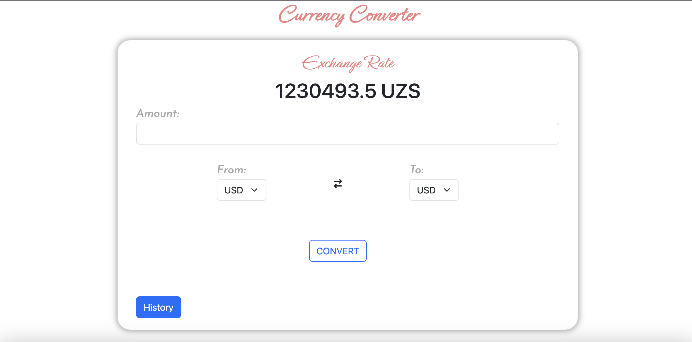

# Currency_App

## Желаем приятного Чтения

> Этот проект для обмена валют.




**Пример программы так работает.**


## Установка и Использование
## Postgres
### Вы должны подключить в настройке базу данных `Postgres` или `SQLite`.
1. Заходите в проэкт > `Settings`  находите конфигурацию базы данных:
** `Postgres` **
 >  ENGINE': 'django.db.backends.postgresql_psycopg2',
  -      'NAME': '',
  -     'USER': '',
  -      'PASSWORD': '',
  -      'HOST': 'localhost',
  -      'PORT':5432,
**Заходите в `Postgres` в вашем компютере и создаете новую датабазу для этого проэкта и указываете его в настройки где `NAME`, указываете вы с какого пользователя его создали `USER` и пароль его `PASSWORD`. **

### Если же можете `SQLite` default базу данные использовать:
    ```
    DATABASES = {
        'default': {
            'ENGINE': 'django.db.backends.sqlite3',
            'NAME': os.path.join(BASE_DIR, 'db.sqlite3'),
        }
    }
    ```

## Проект с использованием pipenv
### Первый очередь вы должны работу с pipenv

Этот проект использует инструмент pipenv для управления зависимостями и виртуальным окружением Python.

### Установка pipenv

1. Убедитесь, что Python установлен на вашем компьютере.
2. Установите pipenv с помощью команды:
    ```
    $ pip install pipenv
    ```
3. Установите зависимости, запустив `pip install -r requirements.txt`

### Клонирование проекта и установка зависимостей

1. Клонируйте репозиторий:
    ```
    $ git clone https://github.com/Humoyun004/Currency_App.git
    ```
2. Заходите в репозиторий:
    ```
    $ cd Currency_App
    ```

3. Запустите команду `pipenv install`, чтобы создать виртуальное окружение и установить все зависимости из файла `Pipfile.lock`.

### Работа с проектом

- Для активации виртуального окружения запустите:
    ```
    pipenv shell
    ```
- Для установки новых зависимостей выполните:
    ```
    pipenv install <название_пакета>
    ```
- Чтобы запустить скрипты или приложение из вашего проекта, используйте `pipenv run`.


**После того, как вы зошли в среду `(Currency_App) Currency_App` в таком ввиде будеть у вас.**

```bash
$ python manage.py makemigrations
```

**Это создаст все файлы миграции (миграции базы данных), необходимые для запуска этого приложения.**

**Теперь, чтобы применить эту миграцию, выполните следующую команду**
```bash
$ python manage.py migrate
```
**Один последний шаг, и тогда наше приложение  будет запущено. Нам нужно создать пользователя-администратора для запуска этого приложения. В терминале введите следующую команду и укажите имя пользователя, пароль и адрес электронной почты для пользователя-администратора.**
```bash
$ python manage.py createsuperuser
```
 **Запустите программу с помощью команды:**
```bash
$ python manage.py runserver
```

4. Выходим из среды:
    ```bash
    $ exit
    ```

## Проект с использованием Docker
### Теперь если у вас Docker есть, смотрим с ним проэкт использовать.

Этот проект использует Docker для управления своим окружением. Чтобы запустить его локально, выполните следующие шаги:

### Шаги для запуска проекта

### Установка Docker

1. Убедитесь, что у вас установлен Docker на вашем компьютере.
2. Если Docker не установлен, вы можете скачать его [отсюда](https://docs.docker.com/get-docker/) и установить в соответствии с инструкциями для вашей операционной системы.

### Запуск проекта
## Мы до это с помощю `pipenv` уже в репозитории заходили,теперь продолжим в этом месте слудующее, но вы сначала заходите в ваш `Docker Desktop` приложение конечно если у вас не `Linux`:
1. Создайте образ Docker, выполнив команду: 
    ```
    $ docker build -t currency:1.0 .
    ```
2. После того как образ будет успешно создан, запустите контейнер: 
    ```
    $ docker run -p 1212:8000 currency:1.0
    ```
3. Проверьте `Dockerfile` если у вас нет образа скачайте с `Docker Hub`:
    ```bash
    $ docker pull python:3.11-alpine
    ```

Теперь ваш проект должен быть доступен в вашем браузере по адресу `https://localhost:1212/`. 

5. Home Page:
    ```
    https://localhost:1212/
    ```
**Домашняя страница проэкта.**

## Проект с без использованием Docker
### Вы можете его без Docker использовать

1. Заходим в среду:
    ```bash
    $ pipenv shell
    ```
2. Вводим команду:
    ```bash
    $ python manage.py runserver
    ```

## Вклад
**Если вы хотите внести свой вклад в развитие приложения  пожалуйста, следуйте этим шагам:**

1. Форкните репозиторий на GitHub.
2. Клонируйте ваш форк репозитория на локальную машину.
3. Создайте новую ветку для вашей функции или исправления ошибки.
4. Внесите изменения и сделайте коммиты с описательными сообщениями.
5. Отправьте ваши изменения в ваш форк репозитория.
6. Создайте pull request (запрос на включение) в основной репозиторий.

## Контакты
**Если у вас есть вопросы или предложения относительно приложения, пожалуйста, свяжитесь с нами по адресу humoyunakbaraliev1@gmail.com. Мы ценим ваше мнение!**


